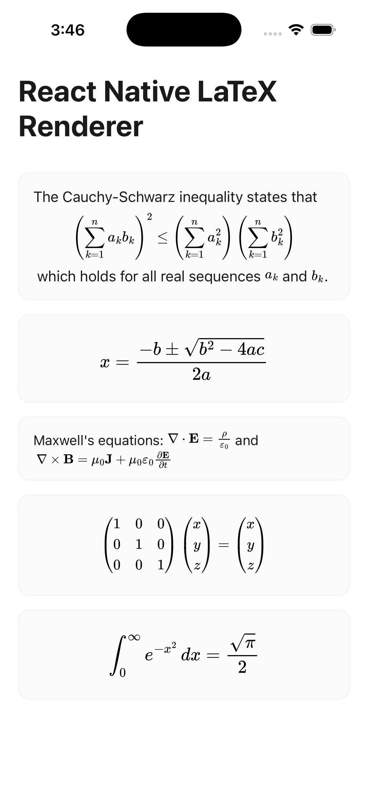

# React Native LaTeX Renderer

A LaTeX renderer for React Native with two rendering modes:

- **`MathView`** (Native SVG) — Renders LaTeX as native SVG using MathJax. No WebView, no network requests, sub-millisecond rendering.
- **`KaTeXAutoHeightWebView`** (WebView) — Renders LaTeX in an auto-resizing WebView using KaTeX.

<p align="center">
  
</p>

## Features

- **Native SVG rendering**: `MathView` converts LaTeX to SVG paths — no WebView overhead, no font loading delay, works fully offline
- **Mixed content**: Inline math and display math in the same string, interleaved with plain text
- **WebView option**: `KaTeXAutoHeightWebView` for full HTML/CSS styling control (requires network for KaTeX font CSS on first load)
- **All standard delimiters**: `$...$`, `$$...$$`, `\(...\)`, `\[...\]`
- **TypeScript**: Fully typed API

## Installation

```sh
npm install @dawsonxiong/react-native-latex-renderer
```

### Peer dependencies

Install the peer dependencies you need based on which components you use:

```sh
# For MathView (native SVG)
npm install react-native-svg

# For KaTeXAutoHeightWebView (WebView)
npm install react-native-webview
```

Both are optional — install only what you need.

## Usage

### MathView (Native SVG — recommended)

Renders LaTeX as native SVG components. No WebView, near-instant rendering.

```tsx
import { MathView } from '@dawsonxiong/react-native-latex-renderer';

// Mixed text + inline math
<MathView math="Einstein showed $E = mc^2$ and the field equation: $$R_{\mu\nu} = 0$$" />

// Styling
<MathView
  math="$$\int_0^\infty e^{-x^2} dx = \frac{\sqrt{\pi}}{2}$$"
  fontSize={20}
  color="blue"
/>

// Error handling
<MathView
  math="$\frac{1}{2}$"
  onError={(error, latex) => console.warn(`Failed to render: ${latex}`, error)}
/>
```

### KaTeXAutoHeightWebView (WebView)

Renders LaTeX inside a WebView with auto-resizing. Supports full HTML/CSS styling.

```tsx
import { KaTeXAutoHeightWebView, createKaTeXHTML } from '@dawsonxiong/react-native-latex-renderer';

const html = createKaTeXHTML(
  'This is a test: $$E = mc^2$$',
  { 'font-size': '18px', 'color': 'black' },  // container styles
  { 'color': 'blue' }                           // LaTeX styles
);

<KaTeXAutoHeightWebView
  source={html}
  onHeightChange={(height) => console.log('Height:', height)}
/>
```

## API Reference

### `MathView`


| Prop       | Type                                    | Default   | Description                                                |
| ---------- | --------------------------------------- | --------- | ---------------------------------------------------------- |
| `math`     | `string`                                | —         | Text with LaTeX delimiters (`$`, `$$`, `\(`, `\[`).        |
| `fontSize` | `number`                                | `16`      | Base font size in pixels.                                  |
| `color`    | `string`                                | `'black'` | Text and math color.                                       |
| `style`    | `ViewStyle`                             | —         | Container style.                                           |
| `onError`  | `(error: Error, latex: string) => void` | —         | Called when a LaTeX segment fails to render.               |
| `debug`    | `boolean`                               | `false`   | Show colored borders around segments for layout debugging. |


### `createKaTeXHTML(content, containerStyles?, latexStyles?)`

Generates the HTML source string for the WebView.


| Parameter         | Type     | Description                               |
| ----------------- | -------- | ----------------------------------------- |
| `content`         | `string` | Text content containing LaTeX delimiters. |
| `containerStyles` | `object` | CSS styles for the HTML container.        |
| `latexStyles`     | `object` | CSS styles applied to KaTeX elements.     |


### `KaTeXAutoHeightWebView`


| Prop             | Type                       | Default | Description                           |
| ---------------- | -------------------------- | ------- | ------------------------------------- |
| `source`         | `string`                   | —       | HTML string from `createKaTeXHTML`.   |
| `onHeightChange` | `(height: number) => void` | —       | Callback when content height changes. |
| `minHeight`      | `number`                   | `50`    | Minimum WebView height.               |
| `containerStyle` | `object`                   | —       | Outer React Native View style.        |
| `...props`       | `WebViewProps`             | —       | Any `react-native-webview` props.     |


### `parseLatex(content)`

Low-level utility that parses a string into structured segments.

```ts
import { parseLatex } from '@dawsonxiong/react-native-latex-renderer';

parseLatex('Hello $x^2$ world');
// [
//   { type: 'text', content: 'Hello ' },
//   { type: 'math', content: 'x^2', display: false },
//   { type: 'text', content: ' world' },
// ]
```

## Delimiters


| Delimiter | Mode    | Example                                         |
| --------- | ------- | ----------------------------------------------- |
| `$...$`   | Inline  | `$E = mc^2$` renders inline with text           |
| `$$...$$` | Display | `$$E = mc^2$$` renders centered on its own line |
| `\(...\)` | Inline  | `\(E = mc^2\)` same as `$...$`                  |
| `\[...\]` | Display | `\[E = mc^2\]` same as `$$...$$`                |


## Contributing

- [Development workflow](CONTRIBUTING.md#development-workflow)
- [Sending a pull request](CONTRIBUTING.md#sending-a-pull-request)
- [Code of conduct](CODE_OF_CONDUCT.md)

## License

MIT